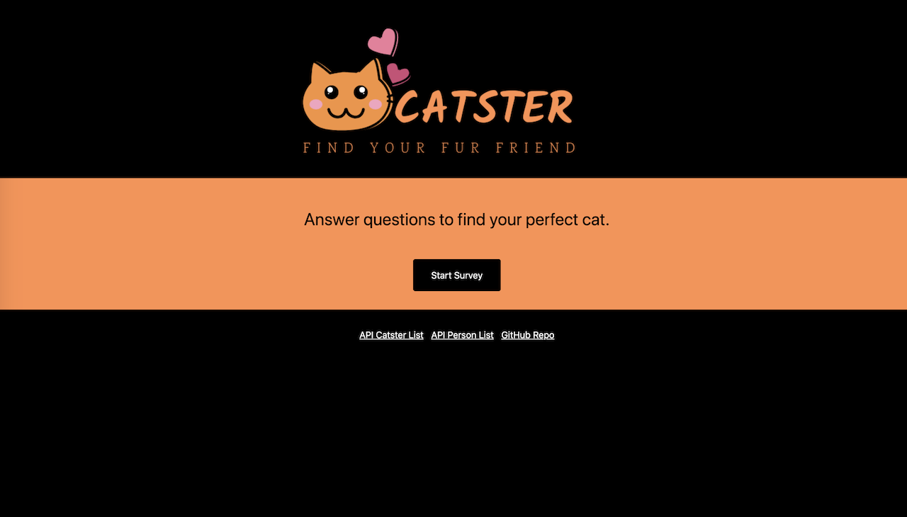

# catster
Catster is an app built to help home adoptable cats with homes suited for them.
[Link to Page](https://vast-escarpment-95713.herokuapp.com/)

## Description
Catster hopes to help you find your fur companion. Answer a few questions and we will match you with a cat in our system that closely matches what you are looking for.

## How to use
Click the start survey button, fill out the form and you will be matched with an adoptable cat from the local rescue that will best match your preferences!

## Tech used
- Visual Studios
- Javascript
- Node.js
- Express
- Handlebars
- Heroku

## Role in Development
Created by one developer

## App Future
This app is one part of a larger app that is still being worked on.